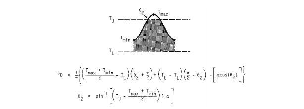

# ITRDegreeDays
It is an open source library for calculating grade days using the simple sinus method.
This trigonometric method adjust some sinus funtions to daily lowest and highest temperatures.
<br/><br/>this method consist in the next 6 cases:
1. Case 1: Completly under two umbrals<br/>

2. Case 2: It is applied when there are minimum temperatures below the lower threshold and the the maximum temperature is higher than the lower threshold but lower than the upper one.

3. Case 3: It develops when the maximum and minimum temperatures are within the thresholds and applies to a 24-hour period.

4. Case 4: It develops when the minimum temperature is above the lower threshold and the maximum temperature is higher than the maximum threshold.

5. Case 5: it is applied when the maximum and minimum temperatures are found above the two thresholds and applies to a 24-hour period.

6. Case 6: It develops when the minimum temperature is lower than the lower threshold and the Maximum temperature is greater than the upper threshold and applies to a 24-hour period.

<br/>

## Installation
```
pip install ITRDegreeDays
```

## Usage
You only have to import DegreeDays library
```python
from degreedays import DegreeDay
```
## Simple example

```python 
case4=DegreeDays(26,14,96,21)
print("Test 1 - Grados días: ",case4)
case6=DegreeDays(26,14,46,10)  
print("Test 2 - Grados días: ", case6)
case2=DegreeDays(26,14,20,10)
print("Test 3 - Grados días: ",case2)   

# OUTPUT
#Test 1 - Grados días:  Días grados: 3.438542704073482
#Test 2 - Grados días:  Días grados: #0.8574860460979651
#Test 3 - Grados días:  Días grados: 2.123487819316327
```
